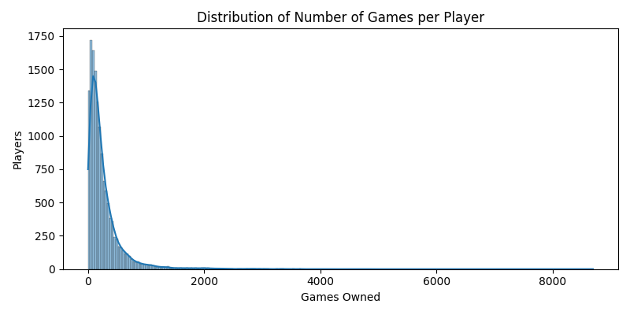
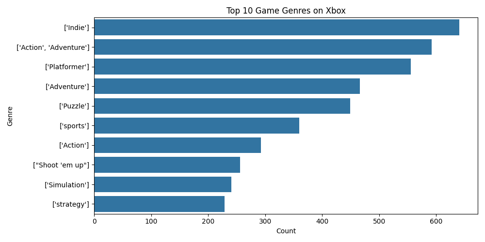
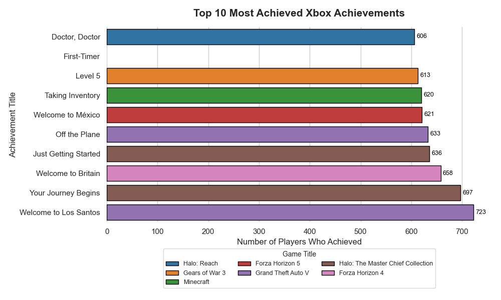
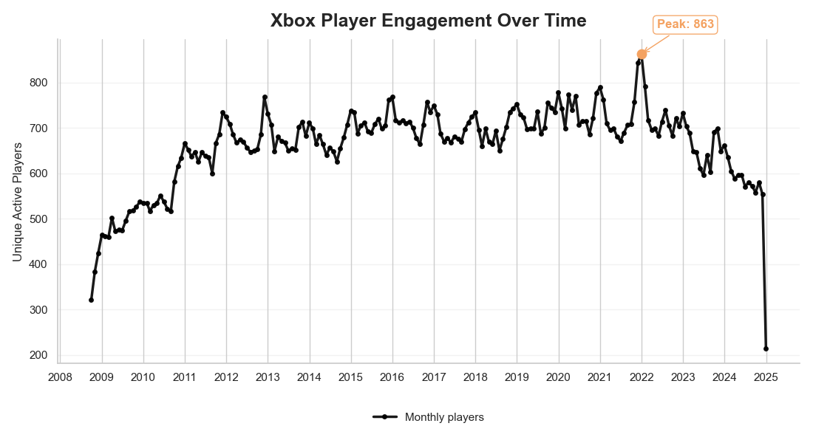
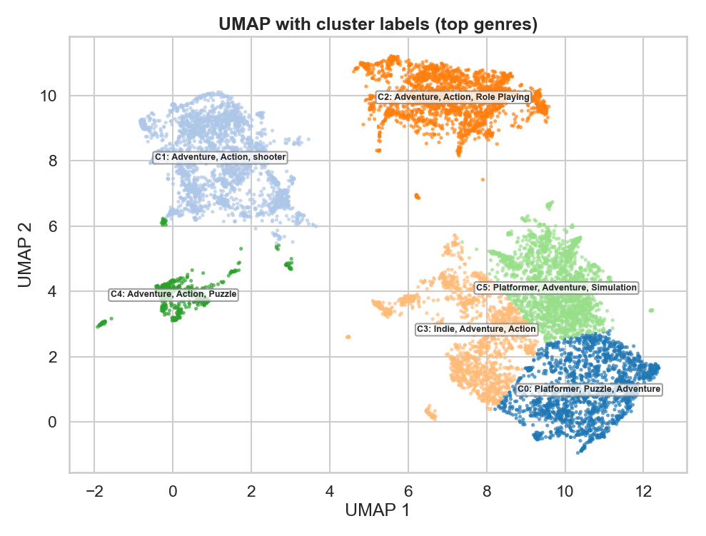

### The Dataset
The dataset consists of gaming engagement files on Microsoft's Xbox console. It includes:
- games.csv: metadata for each published game (title, genres, publishers, etc)
- achievements.csv: achievements made by each player (achievement, game, title, description, points)
- history.csv: player achievement unlocks over time (player, achievemnet, date)
- purchased_games.csv: each players owned games (player, library)
- prices.csv: varying prices, depending on country, of each game (game, price, date of each purchase)
- players.csv: players id with username (id, username)

I chose this dataset because it gives a rich feedback structure, giving me ideal data for a recommendation model. Each player interacts with games through ownership and achievements, this builds a foundation for building an interaction matrix. Furthemore, the dataset it pretty large, uses real data, and is diverse, allwoing for analysis of player behavior, game popularity, engagement dynamics, and genre clustering. This provides me to practice using real-world data to provide recommendations to users that would hopefully generate more profit.

### What I Learned Through Eda
**Data Volume and Completeness**
- The dataset contained hundreds of thousands of player-game interactions. Due to this and my limiting processing speeds of my laptop, I reduced the amount of users to a random 30% of the original dataset. Hence the titling of _reduced. This resulted with a dataset of 82,913 players.

- The amount of data that was missing was minimal with players, purchases, and history having 0 missing values. Games had 8,373 missing values, achievements had 933 missing achievements, and prices with the most missing values at 51,729. Prices had a lot missing due to some games not being sold in other countries (e.g eur, gbp, jpy, rub).

- Engagement follows a long-tail distribution: most players own a small number of games, while a few own many; similarly, a few blockbuster games dominate total engagement. The average number of games owned by a player was 271 and the median was 171. The most games a single person owns is 8,692.

**Distribution of Games Owned**

**Distribution of Games Owned Clipped**

**Games and Achievements**
- Indie games are the single most common genre in the catalog, with over 600 titles represented in the dataset. This reflects the Xbox Store’s large library of smaller, lower-budget games, many of which come from independent developers.
- The next most frequent genres (Action + Adventure, Platformer, and Adventure) show that the Xbox catalog is heavily skewed toward exploration-focused, story-driven, and movement-based gameplay.
- The top 10 most achieved achievements are all starter achievements from the most populars games like GTA V, Halo, and Forza Horizon. This reinforces that achievements can serve as valuable training signals for modeling player engagement. However, this is making the rich, richer. The most number of games being Indie, but all the top performing games come from AAA studios with high budgets.

**Top 20 Games**

**Top 10 Game Genres**

**Distribution of Achievements**

**Top 10 Achievements Earned**

**Pricing**
The chart comparing Average Game Popularity by Price Range highlights an important trend:
-Games in the $50–$60 price range have the highest average unique players, significantly outperforming all other price segments. This aligns with major AAA releases, which typically launch at $59.99.
- Games priced $30–50 also perform reasonably well, suggesting that premium mid-budget titles still attract meaningful player bases.
- Lower-priced games, including indie titles in the $0–20 range, show much lower engagement. Even though they are common in the catalog, they do not attract the same level of broad player activity.

**Average_Price_By_Popularity**

**Temporal Trends**
- Aggregated achievements over time show consistent growth from 2008-2013 and plataeuing until 2022 where we see its peak. We see peaks at the start of almost every turning of the year. This tells us that due to many people (more specifically kids) getting gifts from the holiday season and being at home creates spikes in online engagement. We see a decline after 2024 due to dataset boundaries.

**Engagement Over Time**

**UMAP Clustering & Player Overlap**
The fact that UMAP naturally produced interpretable clusters means :
- Shared player ownership is highly informative.
- A CF model will discover meaningful neighbor relationships.
- Genre-aligned similarity emerges without metadata.
- Cold-start games can be partially mitigated through cluster assignment.
Only issue with the clustering is the overwhelming adventure genre which make the clustering more difficult. Later down the line will need to sort that out so as to not create a similarity between Halo and A Boy and his Blob.

**UMAP Clustering**

### Questions and Issues
**Sparsity and Imbalance**
Many player–game interactions are missing , producing a sparse matrix. Popular games dominate the dataset, risking popularity bias in recommendations.

**Cold Start Problems**
Some players own very few games with some games have <5 owners and provide little collaborative signal.

**Genre Representation**
Genres currently exist as text; a more structured or embedded representation could improve hybrid modeling.

**Modeling Considerations**
Open questions for the next steps:
-Should popular titles be down-weighted to avoid over-representing them?
-How stable are UMAP clusters under different hyperparameters (neighbors, min_dist)?
-Will a pure collaborative filtering model perform well, or will a hybrid model (CF + heurisitc) work better?

**Future Work**
-Build and evaluate a collaborative filtering recommender using the interaction matrix.
-Experiment with hybrid recommenders that incorporate genres or achievement-based features.
-Use UMAP cluster membership as a potential feature for similarity-based recommendations.