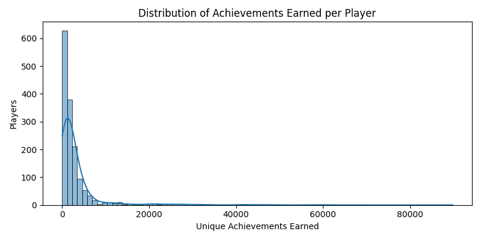
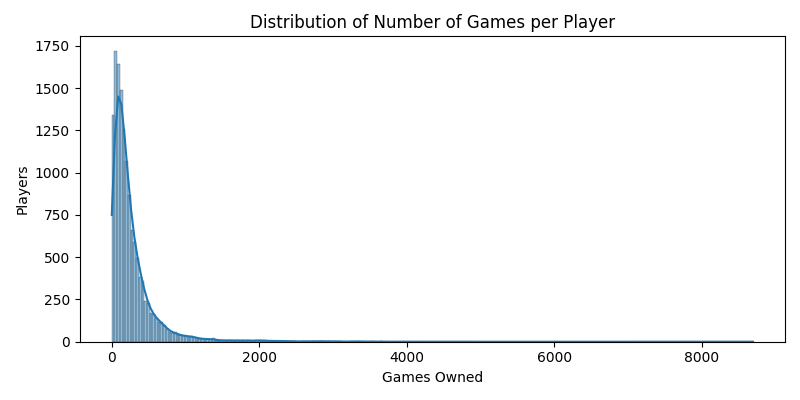
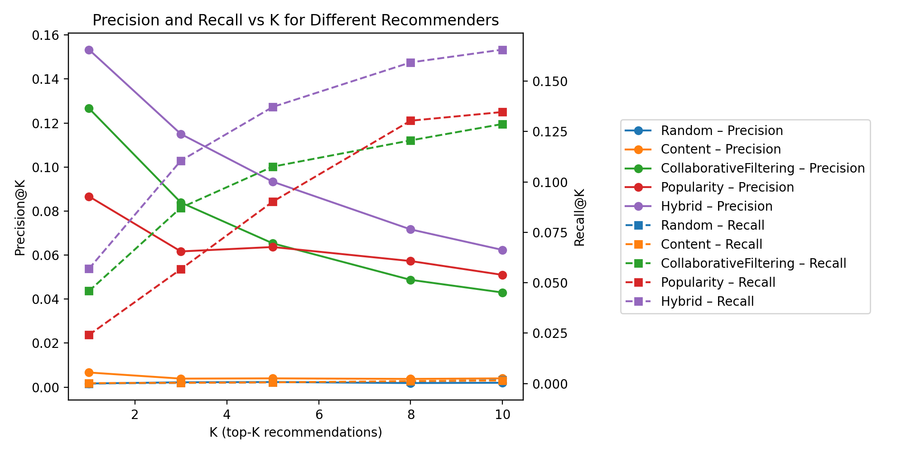
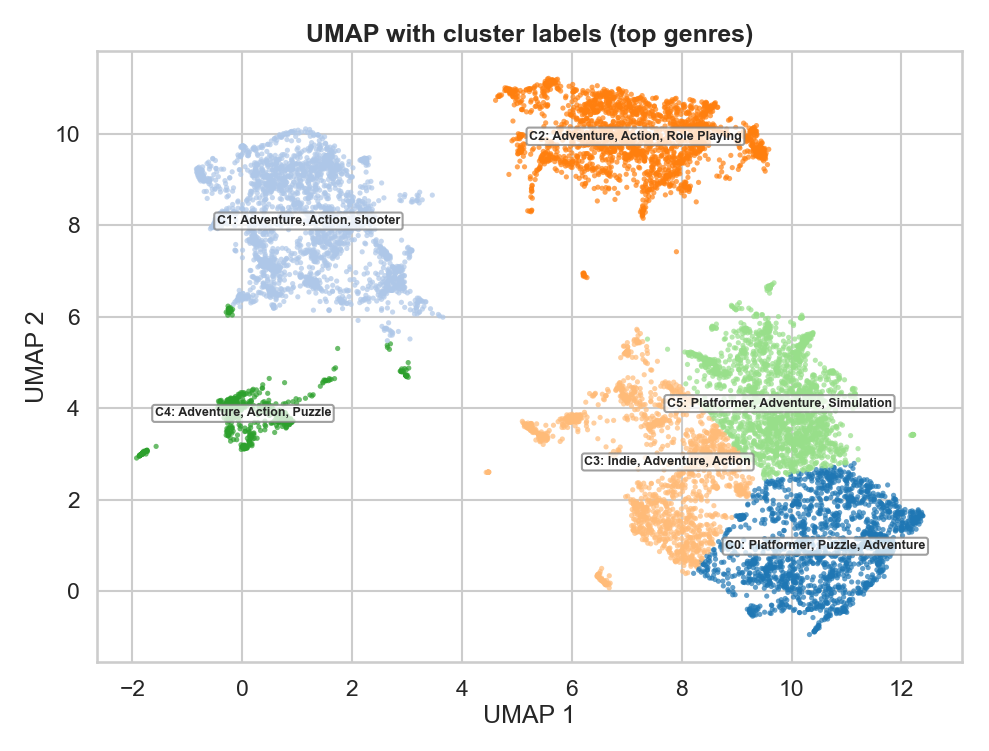
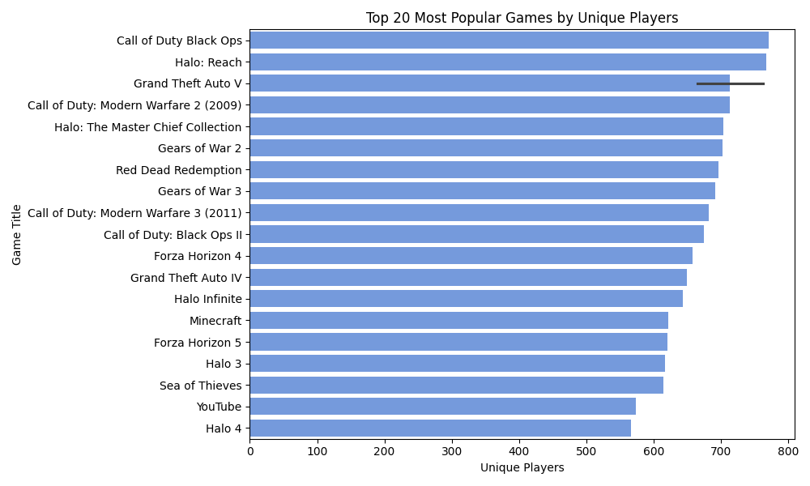

### Personalized Game Recommendations on Xbox Player Behavior Data
**James (Trey) Martin**

### Introduction
The first Xbox was released Novemember 15th, 2001. Since then, tens of thousands of titles have been released to play on the console.
This has created an overwhelming discovery problem for players and a monetization challenge for the platform. Recommendation systems,
used widley by streaming, retail, and social platforms, offer a powerful way to personalize discovery and increase user engagment.
The following presents a complete analysis and recommender system built on a large, real-world dataset of Xbox game ownership, 
engagement history, and pricing data. The goal is to evaluate wether collaborative fitlering (CF), content-based, popularity-based,
and hybrid modeling techniques can provide accurate, data-driven game recommendations for players.

Using ~83K sampled players, millions of interacitons, and a cleaned per-player-per-game achievement matrix, I built a recommendation
pipeline that:
1. Cleans and unifies mutli-table engagement data.
2. Engineers performance-weighted engagement scores.
3. Contructs train/test split using a time-based split.
4. Evaluates multiple recommendations models on Percision@k, Recall@k, and MAP@k.
5. Incorporates domain-aware EDA insights that guide modeling choices.

My findings demonstrate that collaborative filtering significantly outperforms random and content-based models, and that a hybrid 
recommender combining CF, popularity, and content signals performs best overall. This shows that meaningful structure exists in the
Xbox player-game space.

### Dataset Overview
The dataset is composed of six Xbox engagment tables:
- games.csv: Game titles, genres, publishers, languages
- achievements.csv: Achievement metadata per game
- history.csv: Timestamped achievement unlock events
- purchased_games.csv: Player library ownership records
- prices.csv: Historical price points by region
- players.csv: Player identifiers and usernames

I chose this dataset because it provides high-quality behavioral signals: ownership, achievements, recency, and velocity. All great for
transforming into a interaction matrix. The dataset is quite large, sparsely populated, and representative of real-world marketplace 
dynamics, offering challenges aligned with commercial recommender system problems. Due to how massive the original dataset is, a 30%
downsampling was needed due to compute limits. Despite this, it reatins the sufficient statisical richness for analysis.

### Data Engineering & Feature Construction
In order to produce a per-player-per-game interaction table, I merged historical achievements with metadata and computed three critical
behavior features. Before constructing engagement features, it is important to understand the underlying distribution of player activity. 
Achievement counts follow a heavy-tailed pattern, shown below:

Game ownership shows a similar long-tail shape, highlighting sparsity and reinforcing the need to filter out extremely low-signal titles:

**Completed Ratio**

`completed_ratio = player's achievements for game / total achievements for game`
The strongest predictor of "liking" a game.

**Recency Weight**

Exponential decay captures time relevance:
`w = e^-d/180`
where `d` is days since last achievement.

**Engagement Velocity**

Achievements per hour between first and last unlock.

There were normalized and combined into a final engagement score:
score = 0.60r + 0.30w + 0.10v

A game is then labeled "liked" if completed_ratio >= 0.5, forming the positive class used during evaluation. Finally, to avoid sparsity 
issues, I filtered to games with >=15 unique players in the training set. This left me with 3,535 high-signal games.

### Modeling Approach
I evaluated five models:

**1. Random Recommender**
- Baseline for comparison.

**2. Content-Based Recommender**
- Uses only per-game behavioral features.

**3. Popularity Recommender**
- Combines recent player count and like rate.

**4. Collaborative Filtering (CF)**
- ID-based latent relationship modeling; caputers neighbor similarity.

**5. Hybrid Recommender**
- Weighted combination of CF (0.6), Popularity (0.25), and Content (0.15). Which was inspired by Netflix-style blending scoring.

All models were evaluated on unseen games for each user, enforcing a realisitic "recommend something new" situation.

### Evaluation & Results
Metrics:
- Percision@5
- Recall@5
- MAP@5

**Model Comparison**

Random recommender:
- Precision@5: 0.0023
- Recall@5:    0.0006
- MAP@5:       0.0010

Content-Based recommender:
- Precision@5: 0.0040
- Recall@5:    0.0006
- MAP@5:       0.0023

CollaborativeFiltering recommender:
- Precision@5: 0.0653
- Recall@5:    0.1076
- MAP@5:       0.0813

Popularity recommender:
- Precision@5: 0.0637
- Recall@5:    0.0902
- MAP@5:       0.0569

Hybrid recommender:
- Precision@5: 0.0933
- Recall@5:    0.1372
- MAP@5:       0.1091

*Figure X: Precision@K and Recall@K across models. The Hybrid recommender consistently achieves the highest precision and recall 
at all rank cutoffs, while collaborative filtering clearly outperforms content-based and random baselines. Popularity performs well 
at small K but plateaus, showing the benefit of combining it with CF and content signals in the Hybrid model.*

To validate whether meaningful latent structure exists in the player–game space, I computed a UMAP embedding of game-level interactions. 
Distinct clusters emerge, each aligning with genre mixtures:

**Takeaways**
- CF dramatically outperforms random and content models, confirming that player–game interaction patterns are highly structured.
- Popularity alone nearly matches CF in precision, indicating a hit-driven ecosystem.
- Hybrid provides the best overall accuracy, suggesting that blending signals mitigates bias and captures both global and 
personalized structure.

### Strengths & Challenges

**Strengths:**
- Strong latent grouping of games ↔ CF is effective.
- Time-aware scoring captures real engagement.
- Hybrid blending counters sparsity and popularity bias.

Challenges:

- Sparsity: Many niche games have <5 owners, limiting CF utility.
- Genre Imbalance: “Adventure” tag overrepresented, diluting signal.
- Popularity Bias: AAA games dominate interaction volume, inflating like-rate statistics. This imbalance becomes even more clear when 
looking at the top 20 most-played titles, nearly all of which are AAA franchises:

- Cold Start Games: Without achievements or ownership, only metadata can help.

### Conclusion
The results show that Xbox engagement data captures strong behavioral patterns that can be modeled reliably. Collaborative filtering 
performs well because players naturally form preference clusters, and the hybrid model improves further by combining personalized 
signals with broader popularity trends. This confirms that no single approach fully explains player behavior, but their combination 
does. These findings matter because they show that platforms can move beyond simple “most played” lists and meaningfully personalize 
game discovery. A hybrid recommender can surface relevant mid-tier or niche titles while still leveraging the strengths of popular 
trends, improving user experience and increasing engagement.
