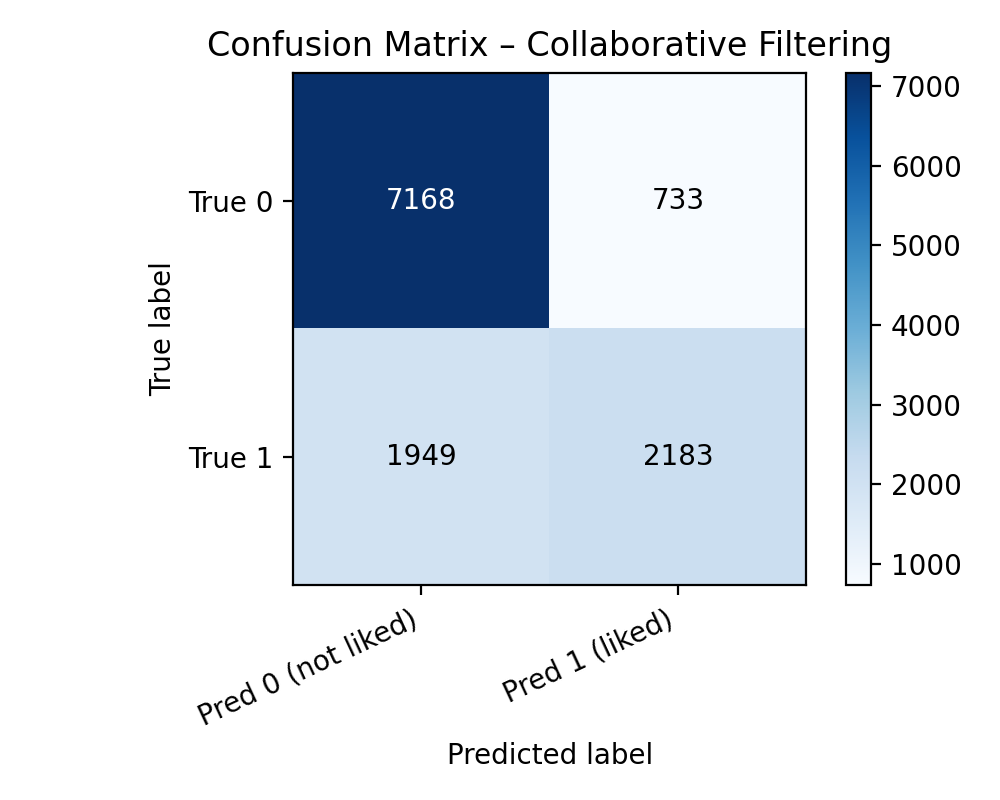

### Strengths and Weaknesses of Baseline
My project so far consists of three recommender models: Random, Collaborative Filtering (CF), and Top-Heuristic (Popularity). 
I will avoid discussing my random as it is just a sanity check for the latter.

**STRENGTHS**
- My Top-Heurisitic model beats random and slightly beats CF on precision and recall scores. It is fairly simple:
it recommends gaems that many players have engaged with and tend to complete many of the games achievements. It
would be used best for cold-start users.
- My CF model captures co-play structure. It doesn't look at the content at all, but only at who plays what and
still beats random. This model is the most personalized as two players witll get different CF recommendation lists.
The confusion matrix demonstrates it does have some ability to seperate liked vs not-liked interactions despite the 
very sparse dataset.
- My evaluation works and I split train/test by time (pre-2024 vs 2024+). Each user is restricted to the games the 
user hasn't played yet in train, so I am evaluating on "true recommendations".

**WEAKNESSES**
- My Top-Heurisitic is not personalized to each user. Every user gets the same global top-list except games the user has
already played. It currently ignores individual preferences which creates a shortfall in how well it does.
- My CF model is underpowered and sparse. Many users have few interactions and the candidate set is huge with 3.5k games 
per user. New or rare games are almost invisible to it because they lack historical data.
- The features being used are lacking. It is mostly being driven by a label called "liked" which is if a user has completed
half of a game's total achievements. I am currently missing out on a lot of signal.

### Possible Reasons for Errors and Bias

**Popularity Bias Toward AAA Titles**
- Popularity over the last 8 months of the training set favors heavily marketed, widely played games. It overshadows niche,
but highly relevant games that a user would actually like. This is seen in my sample recommendations below.

**Data Sparsity**
- Even after filtering to games with greater than 15 players in train, the long tail is still huge. Each evaluated user has
thousands of candidate games where only a fraction are actually labeled positive in the testing.

**Noisy Label Definition**
- My liked label overlooks glong, difficult games that may have many engaged players but low completion, so they get treated
as "not liked". Shorter and easier games may have high compeletion and get labeled as liked even if they user only played a
few times. This is introducing a systematic bias.

**Trend drift**
- Game trends change quickly, so a game that was popular in late 2023 might not be when evaluated or a niche game can blow up.
This can explain some errors where the model pushes a game that was recently popular but not in the user's future positives.

### Ideas for Final Report###

**New Features to Add**
- Richer genre encoding.
- User's average completed_ratio.
- Number of games played / genre diversity.
- Whether the game is from a franchise or developer the user has played before.
- Recency of the user’s last similar game.

**Different ALgorithms**
- Matrix factorization / implicit feedback models to get latent embeddings for users and games.
- Hybrid scoring: Combine CF + Top-Heuristic

### RESULTS

=== Recommender Comparison (TOP_K = 5) ===
Users total: 1515 | Evaluated (with ≥1 positive): 600
Global positive rate (liked): 0.314

Random recommender:
- Precision@K: 0.0023
- Recall@K:    0.0006
- MAP@K:       0.0010

CollaborativeFiltering recommender:
- Precision@K: 0.0423
- Recall@K:    0.0713
- MAP@K:       0.0610

Popularity recommender:
- Precision@K: 0.0640
- Recall@K:    0.0926
- MAP@K:       0.0571

### Sample Top-5 Recommendations (First 5 Evaluated Players)

#### Player 466055 (*GambitOwnsYou*)

- **Held-out positives in test**  
  - 183442 (*Assassin's Creed III Remastered*)  
  - 409706 (*Mafia: Definitive Edition*)  
  - 593425 (*A Building Full of Cats*)

- **Random – top-5** (hits: 0)  
  - 2054 (*Outland*), 1474 (*Feeding Frenzy 2*), 408548 (*Golf Zero*), 2509 (*Unknown title*), 10029 (*Nightmares from the Deep: The Cursed Heart*)

- **CollaborativeFiltering – top-5** (hits: 0)  
  - 1463 (*Dash of Destruction*), 8605 (*Forza Horizon 2 Presents Fast & Furious*), 1746 (*Unknown title*), 12210 (*Quantum Break*), 2861 (*Mass Effect 3*)

- **Popularity – top-5** (hits: 0)  
  - 619781 (*Lies of P*), 592129 (*Ravenlok*), 590826 (*STAR WARS Jedi: Survivor*), 10948 (*Tom Clancy's Rainbow Six Siege*), 570812 (*Dead Space*)

- **Candidate set size**: 3,081

---

#### Player 535035 (*TheRealAJP5467*)

- **Held-out positives in test**  
  - 13972 (*resident evil 4*)  
  - 414966 (*The Medium*)

- **Random – top-5** (hits: 0)  
  - 336748 (*Stretch Arcade*), 2942 (*The Walking Dead*), 419004 (*Call of the Sea*), 380139 (*Yakuza 0 for Windows 10*), 617940 (*NBA 2K24*)

- **CollaborativeFiltering – top-5** (hits: 0)  
  - 1237 (*Assassin's Creed II*), 1225 (*Call of Duty: Modern Warfare 2 (2009)*), 1199 (*Mass Effect 2*), 1183 (*Batman: Arkham Asylum*), 2861 (*Mass Effect 3*)

- **Popularity – top-5** (hits: 0)  
  - 619781 (*Lies of P*), 514024 (*Unknown title*), 592129 (*Ravenlok*), 10948 (*Tom Clancy's Rainbow Six Siege*), 590826 (*STAR WARS Jedi: Survivor*)

- **Candidate set size**: 3,493

---

#### Player 544892 (*WarDaddy DC*)

- **Held-out positives in test**  
  - 11501 (*ROBLOX*)  
  - 393815 (*Rogue Company*)

- **Random – top-5** (hits: 0)  
  - 2764 (*Sonic CD*), 2379 (*Unknown title*), 12000 (*Shadow Complex Remastered*), 17876 (*The Golf Club 2*), 182655 (*Power Rangers: Battle for the Grid*)

- **CollaborativeFiltering – top-5** (hits: 1)  
  - 11501 (*ROBLOX*), 11683 (*Unknown title*), 14136 (*Unknown title*), 10068 (*Unknown title*), 7808 (*MONOPOLY PLUS*)

- **Popularity – top-5** (hits: 0)  
  - 616624 (*Starfield*), 619781 (*Lies of P*), 514024 (*Unknown title*), 592129 (*Ravenlok*), 590826 (*STAR WARS Jedi: Survivor*)

- **Candidate set size**: 3,461

---

#### Player 582268 (*Hungarde*)

- **Held-out positives in test**  
  - 463211 (*Forza Horizon 5*)

- **Random – top-5** (hits: 0)  
  - 30319 (*Far Cry 5*), 1045 (*Prey (2006)*), 465811 (*Space Warlord Organ Trading Simulator*), 546188 (*Despot's Game*), 11781 (*Raiden V*)

- **CollaborativeFiltering – top-5** (hits: 0)  
  - 1237 (*Assassin's Creed II*), 10948 (*Tom Clancy's Rainbow Six Siege*), 11501 (*ROBLOX*), 14898 (*Titanfall 2*), 1225 (*Call of Duty: Modern Warfare 2 (2009)*)

- **Popularity – top-5** (hits: 0)  
  - 616624 (*Starfield*), 619781 (*Lies of P*), 514024 (*Unknown title*), 592129 (*Ravenlok*), 590826 (*STAR WARS Jedi: Survivor*)

- **Candidate set size**: 3,525

---

#### Player 586572 (*PxDemaR*)

- **Held-out positives in test**  
  - 9677 (*World of Tanks*)

- **Random – top-5** (hits: 0)  
  - 1078 (*Unknown title*), 442878 (*Space Jam: A New Legacy – The Game*), 159966 (*NARUTO TO BORUTO: SHINOBI STRIKER*), 6756 (*Transformers: Rise of the Dark Spark*), 16954 (*Late Shift*)

- **CollaborativeFiltering – top-5** (hits: 0)  
  - 11501 (*ROBLOX*), 11683 (*Unknown title*), 10948 (*Tom Clancy's Rainbow Six Siege*), 176537 (*Apex Legends*), 10068 (*Unknown title*)

- **Popularity – top-5** (hits: 0)  
  - 616624 (*Starfield*), 619781 (*Lies of P*), 514024 (*Unknown title*), 592129 (*Ravenlok*), 10948 (*Tom Clancy's Rainbow Six Siege*)

- **Candidate set size**: 3,458

---

